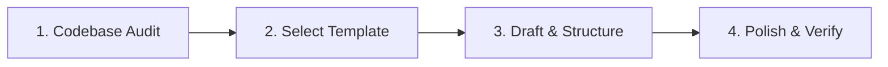

# README Generator Skill

This skill provides an end-to-end framework for generating and maintaining production-grade, visually engaging, and highly readable `README.md` files.

---

## 🌟 Core Philosophy: The Anatomy of a Great README

A stellar README accomplishes four key goals:
1. **Engages Instantly (Above the fold)**: Clearly states what the project does, why it exists, and who it is for within 10 seconds of scanning.
2. **Accelerates Onboarding (Time to "Hello World" < 5 min)**: Delivers clear, copy-pasteable setup and run commands with prerequisite checks.
3. **Explains the Architecture**: Uses clean Mermaid diagrams and directory structures to convey system design and data flow.
4. **Maintains Reliability**: Accurately reflects actual code, commands, flags, and environment variables without hallucinated or outdated placeholders.

---

## 🔄 End-to-End Workflow

Follow this 4-phase workflow whenever creating or updating a README:

### Phase 1: Codebase Audit & Fact Gathering

Before writing, inspect the workspace to extract authentic details:

1. **Project Type & Tech Stack**:
   - Check configuration & manifest files: `package.json`, `pyproject.toml`, `Cargo.toml`, `go.mod`, `pom.xml`, `main.tf`, `Dockerfile`, `docker-compose.yml`, `Makefile`.
   - Identify languages, frameworks, runtime versions, and primary dependencies.
2. **Entry Points & Execution**:
   - Locate main entrypoints (e.g., `src/index.ts`, `main.py`, `cmd/main.go`, `main.tf`).
   - Identify run/build/test scripts defined in package managers or task runners (`npm run ...`, `pytest`, `cargo test`, `make ...`, `terraform plan`).
3. **Configuration & Secrets**:
   - Check `.env.example`, `config.yaml`, `variables.tf`, or settings files.
   - List required vs optional environment variables with descriptions and default values.
4. **Architecture & Directory Structure**:
   - Run a shallow directory tree scan to identify key modules, packages, and layers.
5. **Existing Documentation & License**:
   - Check for existing `LICENSE`, `CONTRIBUTING.md`, architectural notes, or inline comments.

---

### Phase 2: Select Project Template

Choose the best-fitting template archetype based on Phase 1 findings:

- **Infrastructure / Cloud / Terraform**: See [references/templates/infrastructure.md](references/templates/infrastructure.md)
- **Web App / Backend Service / API**: See [references/templates/app.md](references/templates/app.md)
- **CLI Tool / Automation Utility**: See [references/templates/cli.md](references/templates/cli.md)
- **Library / SDK / Package**: See [references/templates/library.md](references/templates/library.md)

---

### Phase 3: Drafting Standard Sections

Every high-quality README should follow this structured hierarchy:

#### 1. Header & Badges
- Project Title (`# <Project Name>`)
- High-level tagline or elevator pitch in bold/blockquote
- Dynamic Shields.io badges (Build status, Release/Version, License, Tech Stack, Cloud Platform).
  - *Reference*: [references/badges_and_styling.md](references/badges_and_styling.md)

#### 2. Key Features
- Use clean bullet points with relevant emojis/icons.
- Focus on user/developer benefits and technical capabilities.

#### 3. Architecture & Data Flow (Mermaid Diagram)
- Include a visual diagram showing how components interact (e.g., UI $\rightarrow$ API $\rightarrow$ Database / Cloud Resources).
- Keep node labels concise and quoted when containing special characters.

#### 4. Project Structure (Curated Tree)
- Provide a curated ASCII/markdown tree highlighting primary directories and files (avoid noise like `node_modules`, `.git`, or build caches).

#### 5. Prerequisites & Requirements
- State exact tooling and minimum versions needed (e.g., Node >= 20.x, Python >= 3.11, Terraform >= 1.5, GCP / AWS CLI).

#### 6. Quickstart / Installation (Step-by-Step)
- Numbered, copy-pasteable steps:
  1. Clone repository
  2. Install dependencies
  3. Configure environment (`cp .env.example .env`)
  4. Run application / deploy infrastructure
  5. Verify / test

#### 7. Configuration & Environment Variables
- Provide a clear markdown table:

| Variable | Description | Type | Default | Required |
| :--- | :--- | :--- | :--- | :---: |
| `DATABASE_URL` | Connection string for PostgreSQL | String | `""` | Yes |
| `PORT` | HTTP server port | Number | `8080` | No |

#### 8. Usage & Examples
- Provide realistic, syntactically highlighted code blocks, API curl requests, or CLI command snippets.

#### 9. Testing & Quality
- Commands to execute unit tests, integration tests, linting, and formatting.

#### 10. Roadmap / Contributing / License
- Link to `LICENSE` and contribution guidelines.

---

### Phase 4: Polish & Verification Checklist

Before finalizing the README:
- [ ] **Accurate Commands**: Every shell command matches actual scripts and package manager configurations.
- [ ] **No Placeholders**: Remove leftover placeholders like `<TODO>`, `YOUR_API_KEY_HERE` (use realistic mock values), or broken URLs.
- [ ] **Valid Markdown & Links**: Ensure all relative links to files, docs, or anchors resolve correctly.
- [ ] **Mermaid Syntax**: Verify Mermaid syntax renders cleanly without unquoted special characters.
- [ ] **Scannability**: Utilize tables, code blocks, bold text, and collapsible `
` blocks for advanced or lengthy instructions.

---

## 📚 References & Resources

- **Badges & Styling Guide**: [references/badges_and_styling.md](references/badges_and_styling.md)
- **Infrastructure & Terraform Template**: [references/templates/infrastructure.md](references/templates/infrastructure.md)
- **Application / API Template**: [references/templates/app.md](references/templates/app.md)
- **CLI Tool Template**: [references/templates/cli.md](references/templates/cli.md)
- **Library / SDK Template**: [references/templates/library.md](references/templates/library.md)
