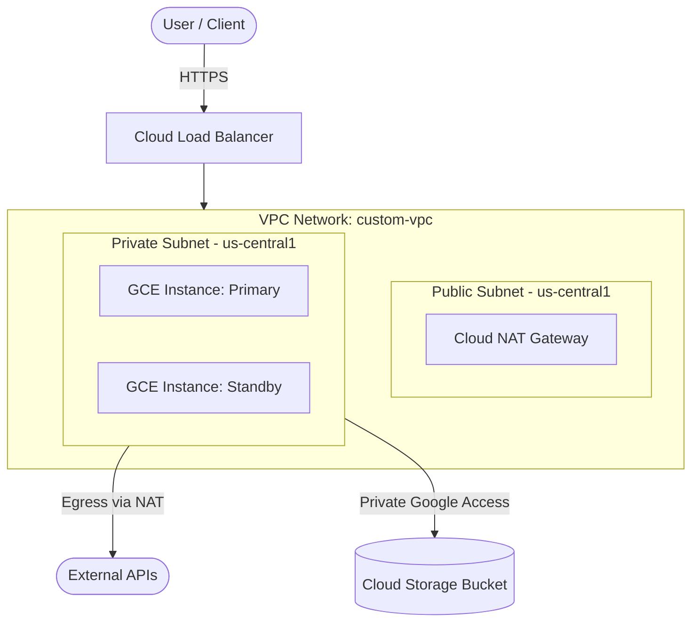

# README Badges and Visual Styling Guide

This guide provides templates and standards for badges, layout tricks, visual components, and collapsible sections.

---

## 🛡️ Shields.io Badges

Use flat-square or for-the-badge style consistently.

### 1. Build & Release
```markdown
[](https://github.com/<USER>/<REPO>/actions)
[](https://github.com/<USER>/<REPO>/releases)
[](LICENSE)
```

### 2. Tech Stack & Tools
```markdown
[](https://www.terraform.io/)
[](https://cloud.google.com/)
[](https://www.python.org/)
[](https://nodejs.org/)
[](https://www.docker.com/)
```

### 3. Code Quality & Coverage
```markdown
[](https://codecov.io/gh/<USER>/<REPO>)
[](https://github.com/astral-sh/ruff)
[](https://prettier.io)
```

---

## 📐 Mermaid Architecture Diagrams

Always use Mermaid for visual clarity without external binary dependencies.

### Example: Cloud / Infrastructure Topology


---

## 🗂️ Collapsible Sections (`<details>`)

Use `<details>` tags for long logs, extensive configuration variable tables, troubleshooting sections, or advanced setups to keep the main README clean and scannable.

```html
<details>
<summary><b>🔍 View Detailed Terraform Variable Reference</b></summary>

| Name | Type | Default | Description |
|---|---|---|---|
| `project_id` | `string` | - | The GCP Project ID |
| `region` | `string` | `"us-central1"` | Target deployment region |
| `machine_type` | `string` | `"e2-standard-4"` | Compute Engine machine specification |

</details>
```

---

## 📊 Standard Tables

Use clear alignment markers (`:---` left, `:---:` center, `---:` right):

```markdown
| Component | Technology | Version | Purpose |
| :--- | :--- | :---: | :--- |
| **Compute** | Google Compute Engine | Gen4 | High performance workload execution |
| **IaC** | HashiCorp Terraform | `>= 1.5` | Declarative cloud resource provisioning |
| **Networking** | Google Cloud VPC | Subnetted | Isolated private network communication |
```
