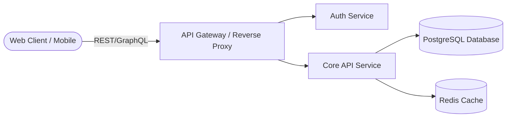

# Web Application & Backend API README Template

Use this template for web applications, REST/GraphQL APIs, microservices, and full-stack projects.

---

```markdown
# <Application Name>

> **<One-line tagline or summary of the application>**

[](https://github.com/<ORG>/<REPO>/actions)
[](LICENSE)
[](https://nodejs.org/)
[](https://www.docker.com/)

---

## 📖 Overview

Brief introduction explaining the problem this application solves, target audience, and primary architectural design.

---

## ✨ Features

- ⚡ **High Performance**: Built with async streaming and caching layers.
- 🔒 **Secure Auth**: JWT/OAuth2 authentication with role-based access control (RBAC).
- 📊 **Real-time Analytics**: Live event streaming and dashboards.
- 🐳 **Containerized**: Production-ready multi-stage Docker builds.

---

## 🏗️ Architecture



---

## 📁 Directory Structure

```text
.
├── src/
│   ├── api/            # Route controllers & request handlers
│   ├── services/       # Core business logic
│   ├── models/         # Database entities / schemas
│   ├── config/         # Environment & runtime configurations
│   └── index.ts        # Application entrypoint
├── tests/              # Unit & integration test suites
├── Dockerfile          # Multi-stage production container
└── package.json
```

---

## 📋 Prerequisites

- [Node.js](https://nodejs.org/) `>= 20.0.0` or [Docker](https://www.docker.com/)
- [PostgreSQL](https://www.postgresql.org/) `>= 15.0`

---

## 🚀 Quickstart

### 1. Clone & Install Dependencies
```bash
git clone https://github.com/<ORG>/<REPO>.git
cd <REPO>
npm install
```

### 2. Environment Configuration
Copy the sample environment variables:
```bash
cp .env.example .env
```

Edit `.env` with your database credentials and secret keys.

### 3. Run Database Migrations
```bash
npm run db:migrate
```

### 4. Start Development Server
```bash
npm run dev
```

Open [http://localhost:3000](http://localhost:3000) in your browser.

---

## ⚙️ Environment Variables

| Variable | Description | Default | Required |
| :--- | :--- | :--- | :---: |
| `PORT` | Port number for the HTTP server | `3000` | No |
| `DATABASE_URL` | PostgreSQL connection string | - | Yes |
| `JWT_SECRET` | Secret key for signing authorization tokens | - | Yes |
| `NODE_ENV` | Environment mode (`development`, `production`, `test`) | `development` | No |

---

## 🧪 Testing

```bash
# Run unit tests
npm test

# Run tests with code coverage
npm run test:coverage

# Run linter & formatter
npm run lint
```

---

## 📄 License

Distributed under the [MIT License](LICENSE).
```
