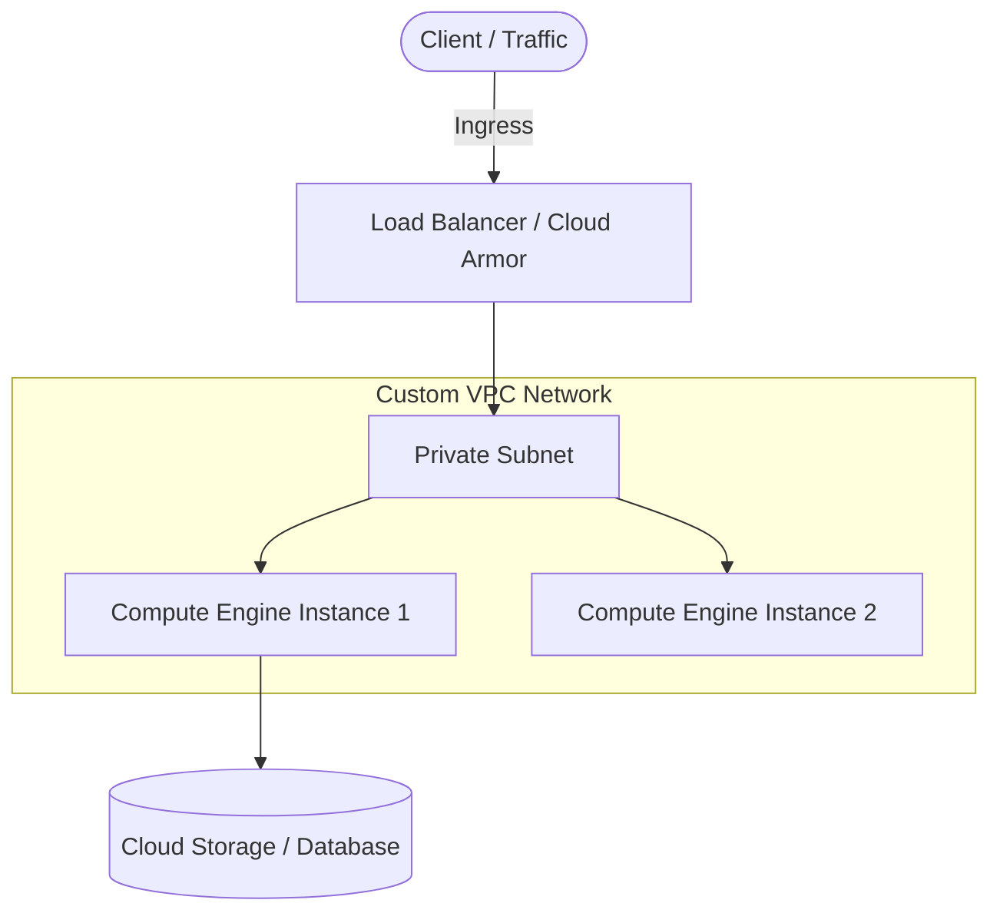

# Infrastructure as Code (Terraform / Cloud) README Template

Use this template for repositories managing cloud resources, Terraform modules, Kubernetes manifests, or infrastructure deployments.

---

```markdown
# <Project / Infrastructure Name>

> **<One-line summary of cloud infrastructure or deployment architecture>**

[](https://www.terraform.io/)
[](https://cloud.google.com/)
[](LICENSE)

---

## 📖 Overview

Brief 2-3 paragraph overview of the infrastructure architecture, intended workload, and business/technical goals.

---

## 🏗️ Architecture



---

## ✨ Features

- **Automated Provisioning**: Fully declarative Terraform modules for turnkey infrastructure setup.
- **Secure Networking**: Private VPC subnets with Cloud NAT for secure egress without public IPs.
- **Scalable Architecture**: Sized and tuned compute instances optimized for high performance.
- **IAM & Least Privilege**: Dedicated service accounts with strictly scoped role assignments.

---

## 📁 Repository Structure

```text
.
├── terraform/
│   ├── main.tf          # Core resource definitions & provider configurations
│   ├── variables.tf     # Input variables and type definitions
│   ├── outputs.tf       # Exported resource identifiers & connection endpoints
│   ├── terraform.tfvars # Default environment parameters
│   └── modules/         # Reusable infrastructure submodules
└── README.md
```

---

## 📋 Prerequisites

Before deploying, ensure you have installed and configured:

- [Terraform](https://developer.hashicorp.com/terraform/downloads) `>= 1.5.0`
- [Google Cloud SDK (`gcloud`)](https://cloud.google.com/sdk/docs/install)
- GCP User/Service Account credentials with appropriate IAM roles (`roles/compute.admin`, `roles/storage.admin`, etc.)

```bash
# Authenticate Google Cloud CLI
gcloud auth login
gcloud auth application-default login
gcloud config set project <YOUR_PROJECT_ID>
```

---

## 🚀 Quickstart & Deployment

### 1. Clone the Repository
```bash
git clone https://github.com/<ORG>/<REPO>.git
cd <REPO>/terraform
```

### 2. Configure Variables
Create or edit `terraform.tfvars`:
```hcl
project_id   = "my-gcp-project"
region       = "us-central1"
zone         = "us-central1-a"
machine_type = "c4-standard-4"
```

### 3. Initialize & Plan
```bash
# Initialize providers and modules
terraform init

# Validate configuration syntax
terraform validate

# Preview infrastructure changes
terraform plan -out=tfplan
```

### 4. Apply Deployment
```bash
terraform apply tfplan
```

---

## ⚙️ Configuration Reference

### Inputs

| Name | Description | Type | Default | Required |
| :--- | :--- | :--- | :--- | :---: |
| `project_id` | GCP Project ID where resources will be provisioned | `string` | - | yes |
| `region` | Primary region for compute and networking | `string` | `"us-central1"` | no |
| `zone` | Target zone within the specified region | `string` | `"us-central1-a"` | no |
| `instance_name` | Name tag for the primary compute instance | `string` | `"gen4-workload-vm"` | no |

### Outputs

| Name | Description | Sensitive |
| :--- | :--- | :---: |
| `instance_self_link` | URI link to the provisioned GCE instance | no |
| `internal_ip` | Private VPC IP address of the instance | no |

---

## 🧹 Teardown / Cleanup

To destroy all provisioned infrastructure and avoid incurring further cloud costs:

```bash
terraform destroy -auto-approve
```

---

## 📄 License

This project is licensed under the [Apache 2.0 License](LICENSE).
```
