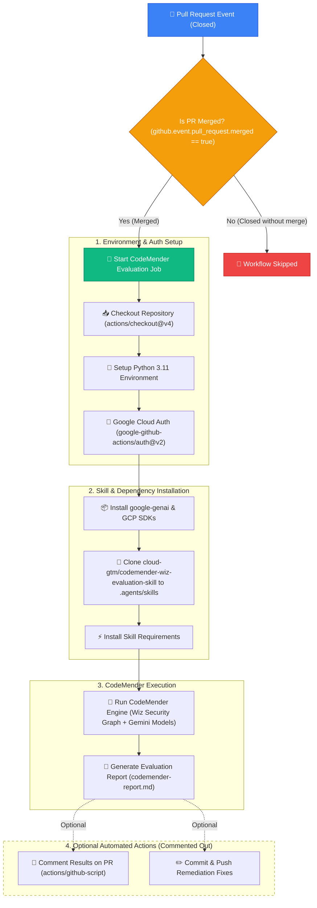

# 🛡️ GitHub Workflows & CodeMender by Wiz Integration

This directory contains the GitHub Actions workflows for automated code evaluation, vulnerability remediation, and security checks using **CodeMender by Wiz**.

---

## 📐 CodeMender Workflow Architecture

The diagram below illustrates the end-to-end execution flow of the [codemender-wiz.yml](file:///Users/vishalapatel/Documents/GitHub/gce-gen4-isv/.github/workflows/codemender-wiz.yml) workflow when a Pull Request is merged into the repository.



---

## 📋 Workflow Steps Breakdown

| Step | Action Name | Description | Required Secrets / Config |
| :--- | :--- | :--- | :--- |
| 1 | **Checkout Codebase** | Checks out repository commit history | Standard `GITHUB_TOKEN` |
| 2 | **Set up Python** | Configures Python 3.11 runner environment | None |
| 3 | **Authenticate to GCP** | Authenticates runner using GCP Service Account or Workload Identity | `GCP_SA_KEY` |
| 4 | **Install Dependencies** | Installs `google-genai` and `google-cloud-storage` | None |
| 5 | **Install Google Skill** | Clones `cloud-gtm/codemender-wiz-evaluation-skill` into `.agents/skills` | None |
| 6 | **Run CodeMender** | Runs the CodeMender Wiz Evaluation engine against merged code | `GEMINI_API_KEY`, `WIZ_API_CLIENT_ID`, `WIZ_API_CLIENT_SECRET` |
| 7 | *(Commented)* **Commit & Push** | Automatically commits generated remediation fixes back to branch | Write permissions |
| 8 | *(Commented)* **Comment PR** | Posts formatted Markdown summary report on the merged PR | Pull Request write permission |

---

## 🔐 Required Secrets Configuration

To run CodeMender successfully, ensure the following secrets are added in **GitHub Repository Settings ➔ Secrets and variables ➔ Actions**:

1. `GCP_SA_KEY`: Google Cloud Service Account JSON Key (or configure Workload Identity Federation).
2. `GEMINI_API_KEY`: API Key for Gemini model access.
3. `WIZ_API_CLIENT_ID`: Wiz Tenant Client ID.
4. `WIZ_API_CLIENT_SECRET`: Wiz Tenant Client Secret.

---

## ⚙️ How to Enable Commented-Out Automated Actions

By default, auto-committing fixes and posting PR comments are **commented out** in [codemender-wiz.yml](file:///Users/vishalapatel/Documents/GitHub/gce-gen4-isv/.github/workflows/codemender-wiz.yml).

To enable them:

### 1. Enable Auto-Committing Fixes
Uncomment lines 72–82 in `codemender-wiz.yml`:
```yaml
- name: Commit and Push CodeMender Fixes
  run: |
    git config --global user.name "github-actions[bot]"
    git config --global user.email "github-actions[bot]@users.noreply.github.com"
    git add .
    if ! git diff --cached --quiet; then
      git commit -m "style: apply CodeMender automated fixes and remediation"
      git push origin ${{ github.event.pull_request.target_commitish }}
    fi
```

### 2. Enable PR Commenting
Uncomment lines 87–101 in `codemender-wiz.yml`:
```yaml
- name: Comment CodeMender Results on PR
  uses: actions/github-script@v7
  with:
    script: |
      const fs = require('fs');
      let report = "### 🛡️ CodeMender by Wiz Evaluation Summary\n\nCodeMender completed evaluation on PR merge.";
      if (fs.existsSync('./codemender-report.md')) {
        report = fs.readFileSync('./codemender-report.md', 'utf8');
      }
      github.rest.issues.createComment({
        issue_number: context.payload.pull_request.number,
        owner: context.repo.owner,
        repo: context.repo.repo,
        body: report
      });
```
