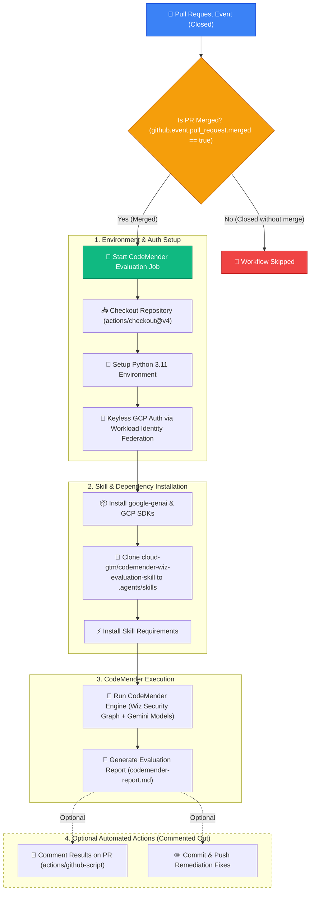

# 🛡️ GitHub Workflows & CodeMender by Wiz Integration

This directory contains the GitHub Actions workflows for automated code evaluation, vulnerability remediation, and security checks using **CodeMender by Wiz**.

---

## 📐 CodeMender Workflow Architecture

The diagram below illustrates the end-to-end execution flow of the [codemender-wiz.yml](file:///Users/vishalapatel/Documents/GitHub/gce-gen4-isv/.github/workflows/codemender-wiz.yml) workflow when a Pull Request is merged into the repository.



---

## 🏗️ Provisioning Workload Identity Federation via Terraform

All required GCP infrastructure for Workload Identity Federation (WIF) is fully managed via Terraform in the [terraform/](file:///Users/vishalapatel/Documents/GitHub/gce-gen4-isv/terraform/) folder:

- **[terraform/wif.tf](file:///Users/vishalapatel/Documents/GitHub/gce-gen4-isv/terraform/wif.tf)**: Provisions `google_iam_workload_identity_pool`, `google_iam_workload_identity_pool_provider`, `google_service_account`, and IAM role bindings.
- **[terraform/api.tf](file:///Users/vishalapatel/Documents/GitHub/gce-gen4-isv/terraform/api.tf)**: Enables required APIs (`sts.googleapis.com`, `iamcredentials.googleapis.com`).
- **[terraform/config.tfvars](file:///Users/vishalapatel/Documents/GitHub/gce-gen4-isv/terraform/config.tfvars)**: Configures project ID and repository (`github_repository = "vishal84/gce-gen4-isv"`).

### Deployment Commands

Deploy the infrastructure using the repository Makefile:

```bash
# 1. Deploy Terraform infrastructure
make deploy
# OR for automated execution:
make deploy-auto

# 2. Retrieve deployed WIF outputs
make output
```

The output will display the exact values to populate in GitHub Secrets:
```text
codemender_service_account_email = "codemender-sa@mongo-experiments.iam.gserviceaccount.com"
wif_provider_name                = "projects/PROJECT_NUMBER/locations/global/workloadIdentityPools/github-pool/providers/github-provider"
```

---

## 🔐 Required GitHub Secrets Configuration

Add these identifiers in **GitHub Repository Settings ➔ Secrets and variables ➔ Actions**:

1. `GCP_WORKLOAD_IDENTITY_PROVIDER`: `wif_provider_name` from Terraform output.
2. `GCP_SERVICE_ACCOUNT`: `codemender_service_account_email` from Terraform output.
3. `GEMINI_API_KEY`: API Key for Gemini model access.
4. `WIZ_API_CLIENT_ID`: Wiz Tenant Client ID.
5. `WIZ_API_CLIENT_SECRET`: Wiz Tenant Client Secret.

---

## 📋 Workflow Steps Breakdown

| Step | Action Name | Description | Required Secrets / Config |
| :--- | :--- | :--- | :--- |
| 1 | **Checkout Codebase** | Checks out repository commit history | Standard `GITHUB_TOKEN` |
| 2 | **Set up Python** | Configures Python 3.11 runner environment | None |
| 3 | **Authenticate via WIF** | Keyless Google Cloud authentication using OIDC | `GCP_WORKLOAD_IDENTITY_PROVIDER`, `GCP_SERVICE_ACCOUNT` |
| 4 | **Install Dependencies** | Installs `google-genai` and `google-cloud-storage` | None |
| 5 | **Install Google Skill** | Clones `cloud-gtm/codemender-wiz-evaluation-skill` into `.agents/skills` | None |
| 6 | **Run CodeMender** | Runs the CodeMender Wiz Evaluation engine against merged code | `GEMINI_API_KEY`, `WIZ_API_CLIENT_ID`, `WIZ_API_CLIENT_SECRET` |
| 7 | *(Commented)* **Commit & Push** | Automatically commits generated remediation fixes back to branch | Write permissions |
| 8 | *(Commented)* **Comment PR** | Posts formatted Markdown summary report on the merged PR | Pull Request write permission |

---

## ⚙️ How to Enable Commented-Out Automated Actions

By default, auto-committing fixes and posting PR comments are **commented out** in [codemender-wiz.yml](file:///Users/vishalapatel/Documents/GitHub/gce-gen4-isv/.github/workflows/codemender-wiz.yml).

To enable them, uncomment lines 71–81 and 86–100 in `codemender-wiz.yml`.
