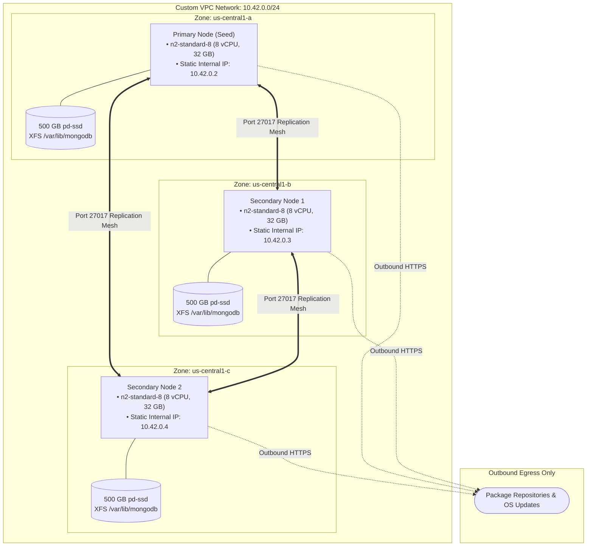

# Multi-Zone Highly Available Compute Cluster on Google Cloud

> **Turnkey, production-grade infrastructure deployment for a self-healing, multi-zone distributed database cluster on Google Compute Engine.**

[](https://www.terraform.io/)
[](https://cloud.google.com/)
[](https://ubuntu.com/)
[](https://cloud.google.com/about/locations)
[](LICENSE)

---

## 📖 Overview

This repository provides automated Terraform configurations to deploy an enterprise-ready, resilient 3-node database cluster across multiple availability zones in Google Cloud (`us-central1-a`, `us-central1-b`, and `us-central1-c`).

Each node is provisioned on dedicated `n2-standard-8` Compute Engine virtual machines backed by high-performance 500 GB persistent SSDs (`pd-ssd`). The infrastructure includes custom VPC networking, strict internal firewall isolation, automated disk formatting with XFS, and automated zero-touch cluster member discovery and replica set initialization upon first boot.

---

## 🏗️ Architecture



---

## ✨ Key Features

- 🌐 **Multi-Zone Fault Tolerance**: Distributes instances evenly across three independent availability zones to withstand single-zone outages.
- ⚡ **Optimized Storage Performance**: Attaches dedicated 500 GB SSD persistent disks (`pd-ssd`) per node, formatted with XFS and tuned mount options (`noatime,nodiratime`).
- 🔒 **Zero Public Ingress**: Database communication is strictly restricted to internal VPC subnet traffic (`10.42.0.0/24`) on port `27017`. Public IPs are utilized solely for outbound OS updates and software installation.
- 🚀 **Zero-Touch Self-Clustering**: Pre-allocates deterministic internal IPs and uses Compute metadata to orchestrate automated primary election and dynamic secondary member registration.
- 🛠️ **Infrastructure as Code**: Modular, declarative Terraform definitions with zero required manual post-provisioning steps.

---

## 📁 Repository Structure

```text
.
├── .agents/
│   └── skills/
│       └── readme-generator/   # README generation & audit skill
├── terraform/
│   ├── main.tf                 # Core compute, network, disk, and template resources
│   ├── variables.tf            # GCP project input variable definition
│   ├── config.tfvars           # Default variables configuration file
│   ├── outputs.tf              # Seed IP, node IPs, and instance name outputs
│   ├── versions.tf             # Terraform and Google provider version constraints
│   └── scripts/
│       └── startup-script.sh   # Automated NVMe tuning, disk mounting & cluster initialization
└── README.md
```

---

## 📋 Prerequisites & Authentication

Before deploying the infrastructure, verify you have the following prerequisites configured:

- [Terraform CLI](https://developer.hashicorp.com/terraform/downloads) `>= 1.5.0`
- [Google Cloud SDK (`gcloud`)](https://cloud.google.com/sdk/docs/install)
- Active GCP Project with billing enabled and Compute Engine API access (`compute.googleapis.com`)

```bash
# Authenticate Google Cloud CLI
gcloud auth login
gcloud auth application-default login

# Configure target project
gcloud config set project <YOUR_GCP_PROJECT_ID>
```

---

## 🚀 Quickstart & Deployment

### 1. Clone the Repository & Navigate to Terraform Directory

```bash
git clone https://github.com/vishal84/gce-gen4-isv.git
cd gce-gen4-isv/terraform
```

### 2. Configure Your Project Variable

Update `config.tfvars` or pass `-var="gcp_project_id=<YOUR_PROJECT_ID>"`:

```hcl
gcp_project_id = "your-gcp-project-id"
```

### 3. Initialize & Validate

```bash
# Initialize Google provider plugins
terraform init

# Validate configuration syntax
terraform validate
```

### 4. Review Execution Plan

```bash
terraform plan -var-file="config.tfvars"
```

### 5. Apply Deployment

```bash
terraform apply -var-file="config.tfvars" -auto-approve
```

Once the Terraform execution completes, the instances will boot up and automatically execute their startup initialization in parallel.

---

## ⚙️ Configuration Reference

### Input Variables

| Variable | Description | Type | Default | Required |
| :--- | :--- | :---: | :---: | :---: |
| `gcp_project_id` | The Google Cloud Project ID where all resources will be created. | `string` | - | **Yes** |

### Outputs

| Output Name | Description | Type |
| :--- | :--- | :---: |
| `mongodb_seed_ip` | Internal IP address of the seed node responsible for initializing the cluster. | `string` |
| `mongodb_node_ips` | List of internal IP addresses for all cluster member nodes. | `list(string)` |
| `mongodb_instance_names` | Names of all deployed Compute Engine instances (`mongodb-1`, `mongodb-2`, `mongodb-3`). | `list(string)` |

---

## 🔍 Deployment Walkthrough

Here is a detailed breakdown of the components provisioned during deployment:

### 1. Networking and Security Layer
- **VPC & Subnet**: Creates a custom VPC (`mongodb-network`) with a dedicated regional subnet (`mongodb-subnet`) in `us-central1` assigned the `10.42.0.0/24` CIDR block.
- **Firewall Isolation**: A firewall rule (`mongodb-allow-replication`) allows TCP ingress on port `27017` exclusively from source IP range `10.42.0.0/24` targeting instances tagged with `mongodb`.
- **IP Reservations**: Three static internal IP addresses are reserved before VM instantiation to ensure fixed routing throughout the cluster lifecycle.

### 2. Compute and Storage Allocation
- **Instance Template**: Defines baseline `n2-standard-8` machines (8 vCPUs, 32 GB memory) running Ubuntu 22.04 LTS on 50 GB `pd-balanced` boot drives.
- **Dedicated Data Volumes**: Creates and attaches independent 500 GB SSD persistent disks (`pd-ssd`) labeled `mongodb-data` to each instance across `us-central1-a`, `us-central1-b`, and `us-central1-c`.

### 3. Automated OS Tuning, Installation, and Self-Clustering
Upon instance creation, [`terraform/scripts/startup-script.sh`](terraform/scripts/startup-script.sh) runs automatically:
1. **Kernel Driver Optimization**: Ensures NVMe and gVNIC kernel drivers are loaded into `initramfs`.
2. **Filesystem Provisioning**: Formats the attached 500 GB SSD volume with `mkfs.xfs` (CRC enabled, 512-byte inodes), mounts it to `/var/lib/mongodb`, and appends UUID-based entries into `/etc/fstab` with `noatime,nodiratime` flags.
3. **Package Installation**: Fetches and installs official MongoDB 7.0 Community Edition packages via verified MongoDB APT repositories.
4. **Daemon Configuration**: Configures `/etc/mongod.conf` with `wiredTiger` storage engine pointing to `/var/lib/mongodb`, binds to `0.0.0.0:27017`, and assigns replica set name `rs-analytics`.
5. **Replica Set Formation**:
   - The instance whose internal IP matches `mongo-seed-ip` executes `rs.initiate()` with priority 2 to establish itself as primary.
   - The remaining nodes query the seed node over internal port `27017` and execute `rs.add()` to register themselves into the `rs-analytics` replica set with priority 1.

---

## 🧹 Teardown & Resource Cleanup

To permanently destroy all provisioned cloud resources, disks, and networking components to avoid ongoing charges:

```bash
cd terraform
terraform destroy -var-file="config.tfvars" -auto-approve
```

---

## 📄 License

This project is licensed under the [Apache 2.0 License](LICENSE).
