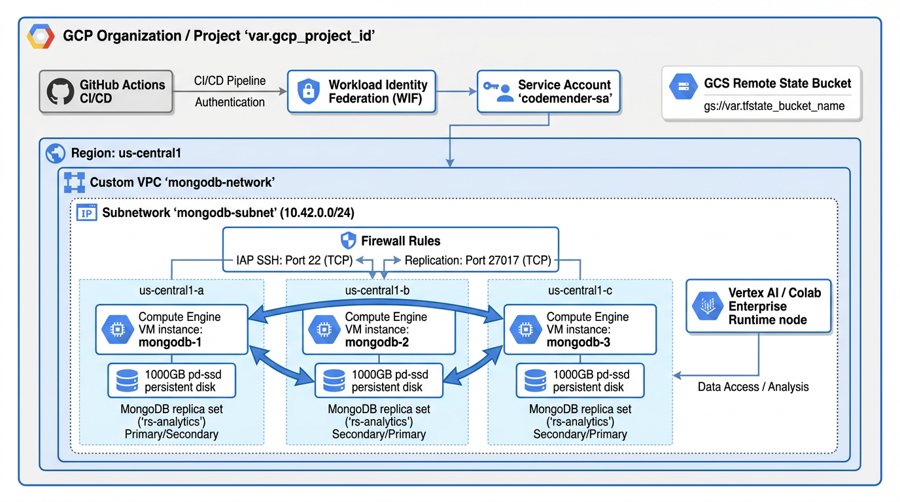

# Multi-Zone Highly Available Compute Cluster on Google Cloud

> **Turnkey, production-grade infrastructure deployment for a self-healing, multi-zone distributed database cluster on Google Compute Engine.**

[](https://www.terraform.io/)
[](https://cloud.google.com/)
[](https://ubuntu.com/)
[](https://cloud.google.com/about/locations)
[](LICENSE)
[](https://github.com/vishal84/gce-gen4-isv/actions/workflows/codemender-wiz.yml)

---

## 📖 Overview

This repository provides automated Terraform configurations to deploy an enterprise-ready, resilient 3-node database cluster across multiple availability zones in Google Cloud (`us-central1-a`, `us-central1-b`, and `us-central1-c`).

Each node is provisioned on dedicated `n2-standard-8` Compute Engine virtual machines backed by high-performance 1 TB persistent SSDs (`pd-ssd`). The infrastructure includes custom VPC networking, strict internal firewall isolation, automated disk formatting with XFS, and automated zero-touch cluster member discovery and replica set initialization upon first boot.

---

## 🏗️ Architecture



---

## ✨ Key Features

- 🌐 **Multi-Zone Fault Tolerance**: Distributes instances evenly across three independent availability zones to withstand single-zone outages.
- ⚡ **Optimized Storage Performance**: Attaches dedicated 1 TB SSD persistent disks (`pd-ssd`) per node, formatted with XFS and tuned mount options (`noatime,nodiratime`).
- 🔒 **Zero Public Ingress**: Database communication is strictly restricted to internal VPC subnet traffic (`10.42.0.0/24`) on port `27017`. Public IPs are utilized solely for outbound OS updates and software installation.
- 🚀 **Zero-Touch Self-Clustering**: Pre-allocates deterministic internal IPs and uses Compute metadata to orchestrate automated primary election and dynamic secondary member registration.
- 📓 **Colab Enterprise Data Generator**: Included Jupyter notebook (`colab/generate_mongodb_data.ipynb`) and optional Terraform Colab Enterprise runtime template (`colab.tf`) for populating synthetic e-commerce and IoT analytics datasets into the cluster over internal VPC IP address range.
- 🛠️ **Infrastructure as Code**: Modular, declarative Terraform definitions with zero required manual post-provisioning steps.

---

## 📁 Repository Structure

```text
.
├── .agents/
│   └── skills/
│       ├── gitignore-generator/ # .gitignore & cloud ignore rules generator
│       └── readme-generator/    # README generation & audit skill
├── colab/
│   ├── generate_mongodb_data.ipynb # Synthetic data generation Jupyter notebook
│   └── README.md                   # Colab notebook documentation and usage guide
├── terraform/
│   ├── api.tf                  # Google Cloud APIs enablement
│   ├── colab.tf                # Colab Enterprise runtime template & instance resources
│   ├── main.tf                 # Core compute, network, disk, and template resources
│   ├── storage.tf              # GCS bucket resource for Terraform remote state
│   ├── variables.tf            # GCP project & state bucket variable definitions
│   ├── config.tfvars           # Default variables configuration file
│   ├── config.tfvars.example   # Example variables template file
│   ├── outputs.tf              # Seed IP, node IPs, and instance name outputs
│   ├── versions.tf             # Terraform constraints and GCS remote backend config
│   └── scripts/
│       └── startup-script.sh   # Automated NVMe tuning, disk mounting & cluster initialization
├── Makefile                    # Makefile for easy dry-run, deployment, and management
├── gcp-config.yaml             # Declarative GCP project & environment configuration
├── .gcloudignore               # Google Cloud deployment file ignore rules
├── .gitignore                  # Source control ignore rules
└── README.md
```

---

## 📋 Prerequisites & Authentication

Before deploying the infrastructure, verify you have the following prerequisites configured:

- [Terraform CLI](https://developer.hashicorp.com/terraform/downloads) `>= 1.5.0`
- [Google Cloud SDK (`gcloud`)](https://cloud.google.com/sdk/docs/install)
- Active GCP Project (`mongo-experiments`) with billing enabled and required APIs enabled

```bash
# Authenticate Google Cloud CLI
gcloud auth login
gcloud auth application-default login

# Configure target project
gcloud config set project mongo-experiments
```

---

## 🚀 Quickstart & Deployment with Makefile

The included `Makefile` simplifies all deployment and operational workflows.

### 1. Bootstrap State Bucket & Initialize Remote Backend

Ensure the GCS remote state bucket (`mongo-experiments-tfstate`) exists and initialize the Terraform GCS backend under prefix `gce-gen4-isv`:

```bash
make bootstrap
```

### 2. Validate Code Syntax & Formatting

```bash
make validate
make fmt
```

### 3. Dry-Run Execution Plan

Review changes safely before applying them:

```bash
make dry-run   # Or: make plan
```

### 4. Deploy Infrastructure

Execute the deployment:

```bash
make deploy          # Interactive confirmation
# OR
make deploy-auto     # Non-interactive (-auto-approve)
```

### 5. Makefile Commands Summary

| Target | Description |
| :--- | :--- |
| `make help` | Display list of all available Makefile commands |
| `make bootstrap` | Ensure GCS bucket `gs://mongo-experiments-tfstate` exists and reconfigure backend |
| `make init` | Initialize Terraform working directory |
| `make dry-run` / `make plan` | Execute Terraform dry-run execution plan |
| `make deploy` / `make apply` | Apply Terraform deployment interactively |
| `make deploy-auto` | Apply Terraform deployment with `-auto-approve` |
| `make validate` | Validate Terraform syntax and configuration logic |
| `make fmt` | Format all Terraform HCL files |
| `make output` | Display output variables (seed IP, node IPs) |
| `make destroy` | Tear down all deployed resources |

---

## 🧪 Post-Deployment SSH Validation

After completing deployment with `make deploy` or `make deploy-auto`, follow these SSH verification steps on each node (`mongodb-1`, `mongodb-2`, `mongodb-3`) to confirm that all infrastructure, storage, services, and cluster replication are functioning as expected.

### 1. SSH into Cluster Nodes

Connect to each node using `gcloud compute ssh` (replace zone as necessary):

```bash
# Seed Node (us-central1-a)
gcloud compute ssh mongodb-1 --zone=us-central1-a

# Secondary Node 1 (us-central1-b)
gcloud compute ssh mongodb-2 --zone=us-central1-b

# Secondary Node 2 (us-central1-c)
gcloud compute ssh mongodb-3 --zone=us-central1-c
```

---

### 2. Verify Startup Script Execution Log

Check `/var/log/mongo-autoscale-startup.log` on each node to ensure the zero-touch automated initialization completed without errors:

```bash
sudo tail -n 30 /var/log/mongo-autoscale-startup.log
```

**Expected Result:**
The output log should end with:
```text
=== MongoDB Node Initialization Complete ===
```

---

### 3. Verify Dedicated Storage Disk and XFS Mount

Verify that the 1 TB persistent SSD (`pd-ssd`) is correctly formatted with XFS and mounted at `/var/lib/mongodb` with tuned mount flags (`noatime,nodiratime`):

```bash
# Check filesystem mount and available space
df -hT /var/lib/mongodb

# Verify mount options
mount | grep /var/lib/mongodb

# Verify persistent /etc/fstab entry
grep /var/lib/mongodb /etc/fstab
```

**Expected Result:**
- `df -hT` shows `/dev/nvme*` or `/dev/sd*` mounted on `/var/lib/mongodb` with Type `xfs` and size ~1000G.
- `mount` output includes `(rw,noatime,nodiratime,attr2,inode64,logbufs=8,logbsize=32k,noquota)`.

---

### 4. Check MongoDB Service Status and Port Binding

Confirm that the systemd `mongod` service is active/running and listening locally on port `27017`:

```bash
# Check service status
sudo systemctl status mongod

# Verify network socket binding on port 27017
sudo ss -tulpn | grep 27017
```

**Expected Result:**
- `mongod.service` shows `Active: active (running)`.
- `ss` command shows `LISTEN` on `0.0.0.0:27017` or `*:27017`.

---

### 5. Check Replica Set Health (`rs.status()` & `db.hello()`)

Run `mongosh` on any node to verify that all 3 nodes (`10.42.0.2`, `10.42.0.3`, `10.42.0.4`) have joined the `rs-analytics` replica set and are healthy:

```bash
# Check node role (PRIMARY vs SECONDARY)
mongosh --port 27017 --quiet --eval "db.hello()"

# Detailed replica set topology and member health
mongosh --port 27017 --quiet --eval "rs.status()"
```

**Expected Result:**
- One node will report `"isWritablePrimary": true` (state `PRIMARY`), and two nodes will report `"isSecondary": true` (state `SECONDARY`).
- In `rs.status()`, all 3 members should have `"health": 1` and `"stateStr"` equal to `"PRIMARY"` or `"SECONDARY"`.

---

### 6. End-to-End Data Replication Verification

Perform a write operation on the Primary node and verify read replication on Secondary nodes:

#### On the Primary Node (`mongodb-1`):
```bash
# Insert a test document into 'testdb'
mongosh --port 27017 --eval '
  db.getSiblingDB("testdb").testcol.insertOne({
    cluster: "rs-analytics",
    status: "verified",
    created_at: new Date()
  })
'
```

#### On any Secondary Node (`mongodb-2` or `mongodb-3`):
```bash
# Query the document using secondary read preference
mongosh --port 27017 --eval '
  db.getSiblingDB("testdb").testcol.find().readPref("secondary")
'
```

#### Cleanup Test Data on the Primary Node:
```bash
mongosh --port 27017 --eval 'db.getSiblingDB("testdb").testcol.drop()'
```

**Expected Result:**
The secondary node successfully queries and outputs the inserted test document, confirming full multi-zone database replication across the cluster.

---

## ⚙️ Configuration Reference

### Input Variables

| Variable | Description | Type | Default | Required |
| :--- | :--- | :---: | :---: | :---: |
| `gcp_project_id` | The Google Cloud Project ID where all resources will be created. | `string` | - | **Yes** |
| `github_repository` | GitHub repository in `owner/repo` format for WIF authentication. | `string` | - | **Yes** |
| `tfstate_bucket_name` | Name of the GCS bucket used to store Terraform remote state. | `string` | `mongo-experiments-tfstate` | No |
| `enable_colab_runtime` | Whether to deploy Google Cloud Colab Enterprise runtime template and instance for data generation. | `bool` | `false` | No |
| `colab_runtime_user` | User email for the Colab Enterprise runtime instance. | `string` | `""` | No |

### Outputs

| Output Name | Description | Type |
| :--- | :--- | :---: |
| `mongodb_seed_ip` | Internal IP address of the seed node responsible for initializing the cluster. | `string` |
| `mongodb_node_ips` | List of internal IP addresses for all cluster member nodes. | `list(string)` |
| `mongodb_instance_names` | Names of all deployed Compute Engine instances (`mongodb-1`, `mongodb-2`, `mongodb-3`). | `list(string)` |
| `colab_runtime_template_id` | Resource ID of the Colab Enterprise runtime template (if enabled). | `string` |
| `colab_runtime_id` | Resource ID of the active Colab Enterprise runtime instance (if enabled). | `string` |


---

## 🔍 Deployment Walkthrough

Here is a detailed breakdown of the components provisioned during deployment:

### 1. Networking and Security Layer
- **VPC & Subnet**: Creates a custom VPC (`mongodb-network`) with a dedicated regional subnet (`mongodb-subnet`) in `us-central1` assigned the `10.42.0.0/24` CIDR block.
- **Firewall Isolation**: A firewall rule (`mongodb-allow-replication`) allows TCP ingress on port `27017` exclusively from source IP range `10.42.0.0/24` targeting instances tagged with `mongodb`.
- **IP Reservations**: Three static internal IP addresses are reserved before VM instantiation to ensure fixed routing throughout the cluster lifecycle.

### 2. Compute and Storage Allocation
- **Instance Template**: Defines baseline `n2-standard-8` machines (8 vCPUs, 32 GB memory) running Ubuntu 22.04 LTS on 50 GB `pd-balanced` boot drives.
- **Dedicated Data Volumes**: Creates and attaches independent 1 TB SSD persistent disks (`pd-ssd`) labeled `mongodb-data` to each instance across `us-central1-a`, `us-central1-b`, and `us-central1-c`.

### 3. Automated OS Tuning, Installation, and Self-Clustering
Upon instance creation, [`terraform/scripts/startup-script.sh`](terraform/scripts/startup-script.sh) runs automatically:
1. **Kernel Driver Optimization**: Ensures NVMe and gVNIC kernel drivers are loaded into `initramfs`.
2. **Filesystem Provisioning**: Formats the attached 1 TB SSD volume with `mkfs.xfs` (CRC enabled, 512-byte inodes), mounts it to `/var/lib/mongodb`, and appends UUID-based entries into `/etc/fstab` with `noatime,nodiratime` flags.
3. **Package Installation**: Fetches and installs official MongoDB 7.0 Community Edition packages via verified MongoDB APT repositories.
4. **Daemon Configuration**: Configures `/etc/mongod.conf` with `wiredTiger` storage engine pointing to `/var/lib/mongodb`, binds to `0.0.0.0:27017`, and assigns replica set name `rs-analytics`.
5. **Replica Set Formation**:
   - The instance whose internal IP matches `mongo-seed-ip` executes `rs.initiate()` with priority 2 to establish itself as primary.
   - The remaining nodes query the seed node over internal port `27017` and execute `rs.add()` to register themselves into the `rs-analytics` replica set with priority 1.

---

## 🧹 Teardown & Resource Cleanup

To permanently destroy all provisioned cloud resources, disks, and networking components to avoid ongoing charges:

```bash
cd terraform
terraform destroy -var-file="config.tfvars" -auto-approve
```

---

## 📄 License

This project is licensed under the [Apache 2.0 License](LICENSE).
