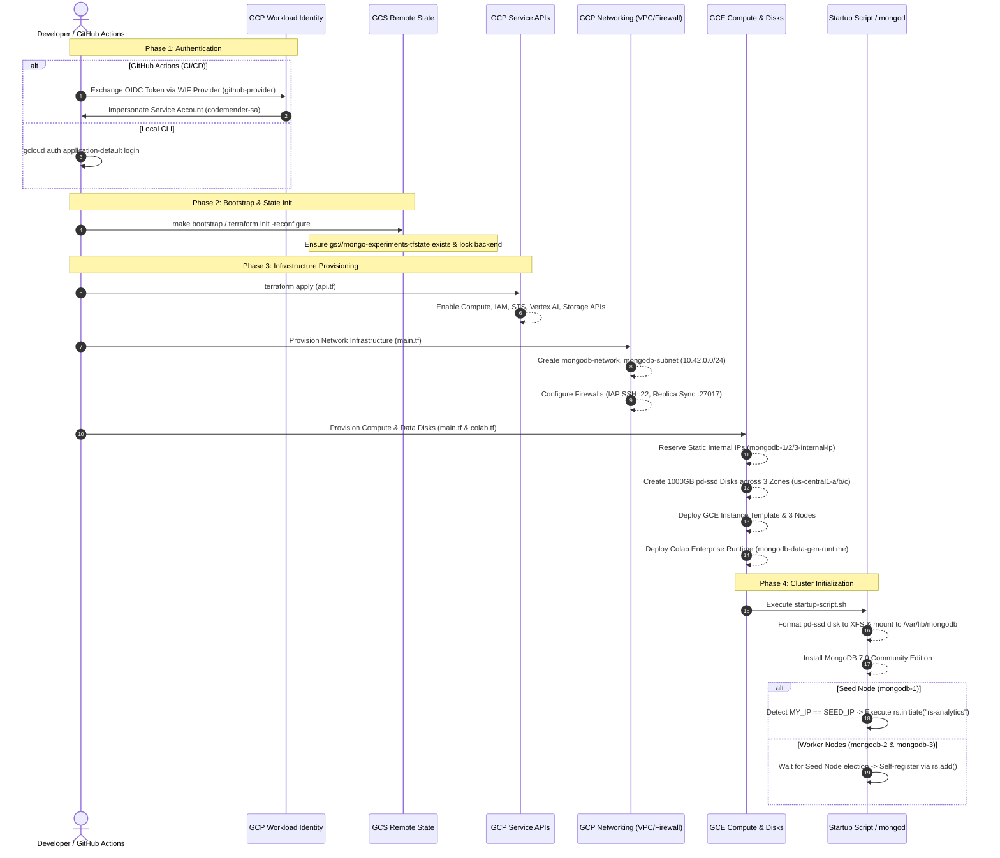

# GCP Architecture Diagram & Deployment Guide for `terraform/`

This document details the Google Cloud Platform (GCP) architecture and deployment lifecycle defined in the `terraform/` directory.

---

## 1. Visual GCP Architecture Diagram


---

## 2. Interactive Component Architecture Diagram

The diagram below details the GCP resources, network hierarchy, security controls, compute resources, and identity management provisioned by Terraform.

```mermaid
flowchart TB
    subgraph GCP_Org["GCP Organization / Parent Folder"]
        subgraph GCP_Project["GCP Project: var.gcp_project_id (e.g., mongo-experiments)"]
            
            subgraph Security_Identity["Identity & Access Management (wif.tf & api.tf)"]
                GCP_APIs["GCP Service APIs<br/>• compute.googleapis.com<br/>• iam.googleapis.com & sts<br/>• aiplatform & notebooks<br/>• storage.googleapis.com"]
                
                subgraph WIF["Workload Identity Federation"]
                    WIF_Pool["WIF Pool: github-pool"]
                    WIF_Provider["WIF Provider: github-provider<br/>(OIDC token.actions.githubusercontent.com)"]
                    SA["Service Account: codemender-sa<br/>Role: roles/editor"]
                    
                    WIF_Pool --> WIF_Provider
                    WIF_Provider -->|IAM Impersonation| SA
                end
            end

            subgraph Remote_State["Remote State Storage (storage.tf & versions.tf)"]
                GCS_Bucket["GCS Bucket: gs://var.tfstate_bucket_name<br/>• Class: STANDARD (us-central1)<br/>• Uniform Bucket Level Access<br/>• Object Versioning Enabled<br/>• Lifecycle: Delete > 5 archived"]
            end

            subgraph VPC_Network["Custom VPC Network: mongodb-network (main.tf)"]
                subgraph Subnet["Subnetwork: mongodb-subnet (10.42.0.0/24 - us-central1)"]
                    
                    subgraph Firewalls["Firewall Rules"]
                        FW_Repl["mongodb-allow-replication<br/>• Ingress TCP:27017<br/>• Source: 10.42.0.0/24<br/>• Target Tag: mongodb"]
                        FW_IAP["mongodb-allow-iap-ssh<br/>• Ingress TCP:22<br/>• Source: 35.235.240.0/20 (IAP)<br/>• Target Tag: mongodb"]
                    end

                    subgraph Zone_A["us-central1-a"]
                        IP_1["Static Internal IP<br/>mongodb-1-internal-ip"]
                        Node_1["GCE Instance: mongodb-1<br/>• Machine: n2-standard-8<br/>• Boot: 50GB pd-balanced<br/>• OS: Ubuntu 22.04 LTS"]
                        Disk_1[("pd-ssd: mongodb-1-data<br/>1000 GB (Mounted XFS)")]
                        
                        IP_1 --- Node_1
                        Node_1 --- Disk_1
                    end

                    subgraph Zone_B["us-central1-b"]
                        IP_2["Static Internal IP<br/>mongodb-2-internal-ip"]
                        Node_2["GCE Instance: mongodb-2<br/>• Machine: n2-standard-8<br/>• Boot: 50GB pd-balanced<br/>• OS: Ubuntu 22.04 LTS"]
                        Disk_2[("pd-ssd: mongodb-2-data<br/>1000 GB (Mounted XFS)")]
                        
                        IP_2 --- Node_2
                        Node_2 --- Disk_2
                    end

                    subgraph Zone_C["us-central1-c"]
                        IP_3["Static Internal IP<br/>mongodb-3-internal-ip"]
                        Node_3["GCE Instance: mongodb-3<br/>• Machine: n2-standard-8<br/>• Boot: 50GB pd-balanced<br/>• OS: Ubuntu 22.04 LTS"]
                        Disk_3[("pd-ssd: mongodb-3-data<br/>1000 GB (Mounted XFS)")]
                        
                        IP_3 --- Node_3
                        Node_3 --- Disk_3
                    end

                    subgraph AI_ML_Layer["Analytics / AI/ML Layer (colab.tf)"]
                        Colab_Runtime["Vertex AI / Colab Enterprise Runtime<br/>mongodb-data-gen-runtime<br/>• Machine: e2-standard-4<br/>• Disk: 100GB pd-standard"]
                    end

                end
            end
        end
    end

    GitHub_Actions["GitHub Actions / CI Workflow<br/>(assertion.repository = var.github_repository)"] -->|OIDC Auth| WIF_Provider
    Developer_CLI["Developer Machine / CLI<br/>(gcloud & terraform CLI / Makefile)"] -->|gcloud ADC Auth| GCP_Project
    
    Node_1 <-->|MongoDB Port 27017<br/>rs-analytics Replication| Node_2
    Node_2 <-->|MongoDB Port 27017<br/>rs-analytics Replication| Node_3
    Node_3 <-->|MongoDB Port 27017<br/>rs-analytics Replication| Node_1

    Colab_Runtime -.->|Internal Query / Synthetic Data Gen| IP_1
```

---

## 3. Deployment Lifecycle & Execution Workflow

The deployment of the `terraform/` directory follows a phased lifecycle, executable either locally via `Makefile` or automatically via GitHub Actions / CI/CD pipelines.



---

## 4. Terraform Component & File Mapping

| File | Primary GCP Components Provisioned | Key Configuration & Resource Names |
| :--- | :--- | :--- |
| [`versions.tf`](file:///Users/vishalapatel/Documents/GitHub/gce-gen4-isv/terraform/versions.tf) | Terraform Provider & GCS Remote Backend | `hashicorp/google` (~> 5.0), `backend "gcs"` (`bucket = "mongo-experiments-tfstate"`) |
| [`api.tf`](file:///Users/vishalapatel/Documents/GitHub/gce-gen4-isv/terraform/api.tf) | GCP Project Service Enablement | Enables 9 core APIs: Compute, IAM, STS, Cloud Resource Manager, Storage, Org Policy, Vertex AI, Notebooks |
| [`storage.tf`](file:///Users/vishalapatel/Documents/GitHub/gce-gen4-isv/terraform/storage.tf) | Remote State Bucket | `google_storage_bucket.terraform_state` (`prevent_destroy = true`, Uniform Bucket Access, Versioning) |
| [`wif.tf`](file:///Users/vishalapatel/Documents/GitHub/gce-gen4-isv/terraform/wif.tf) | OIDC Workload Identity Federation & IAM | `google_iam_workload_identity_pool.github_pool`, `github_provider`, `google_service_account.codemender` (`roles/editor`) |
| [`main.tf`](file:///Users/vishalapatel/Documents/GitHub/gce-gen4-isv/terraform/main.tf) | Network, Storage & Multi-Zone Compute Cluster | VPC `mongodb-network`, Subnet `mongodb-subnet` (`10.42.0.0/24`), 2 Firewalls, 3 Static Internal IPs, 3 1TB SSD Disks, Instance Template & 3 GCE Nodes |
| [`colab.tf`](file:///Users/vishalapatel/Documents/GitHub/gce-gen4-isv/terraform/colab.tf) | Vertex AI / Colab Enterprise Notebook | `google_notebooks_runtime.mongodb_data_gen` (`e2-standard-4`, 100GB disk) attached to `mongodb-subnet` |
| [`variables.tf`](file:///Users/vishalapatel/Documents/GitHub/gce-gen4-isv/terraform/variables.tf) | Input Parameters | `gcp_project_id`, `tfstate_bucket_name`, `github_repository`, `enable_colab_runtime`, `colab_runtime_user` |
| [`outputs.tf`](file:///Users/vishalapatel/Documents/GitHub/gce-gen4-isv/terraform/outputs.tf) | Terraform State Outputs | `mongodb_seed_ip`, `mongodb_node_ips`, `mongodb_instance_names`, `wif_provider_name`, `codemender_service_account_email`, `colab_runtime_id` |
| [`startup-script.sh`](file:///Users/vishalapatel/Documents/GitHub/gce-gen4-isv/terraform/scripts/startup-script.sh) | In-Instance Automated Cluster Bootstrap | NVMe/gVNIC driver setup, XFS disk formatting/mounting, MongoDB 7.0 installation, WiredTiger config, `rs-analytics` replica set initiation & auto-registration |

---

## 5. Key Architectural & Security Design Principles

1. **High Availability & Multi-Zone Fault Tolerance**:
   - The MongoDB cluster is spread across three distinct availability zones (`us-central1-a`, `us-central1-b`, `us-central1-c`).
   - Dedicated 1,000 GB High-IOPS persistent SSDs (`pd-ssd`) are mounted independently per zone.

2. **Keyless Authentication via Workload Identity Federation**:
   - No hardcoded GCP Service Account JSON keys are stored or checked into version control.
   - GitHub Actions authenticates securely using short-lived OIDC tokens mapped directly to the `github_repository` variable.

3. **Least-Privilege Network Isolation**:
   - **Internal Replication Isolation**: Firewall rule `mongodb-allow-replication` restricts MongoDB port `27017` ingress strictly to intra-subnet communication (`10.42.0.0/24`).
   - **Zero Public SSH**: SSH access is restricted exclusively through Google Cloud Identity-Aware Proxy (IAP) via IP block `35.235.240.0/20` (`mongodb-allow-iap-ssh`), eliminating open port `22` internet exposure.

4. **Zero-Touch Self-Clustering Nodes**:
   - Instance metadata delivers the seed IP (`mongo-seed-ip = mongodb-1-internal-ip`).
   - Upon VM boot, `startup-script.sh` handles disk formatting, installs MongoDB 7.0, and coordinates replica set election/joining automatically without manual SSH intervention.
